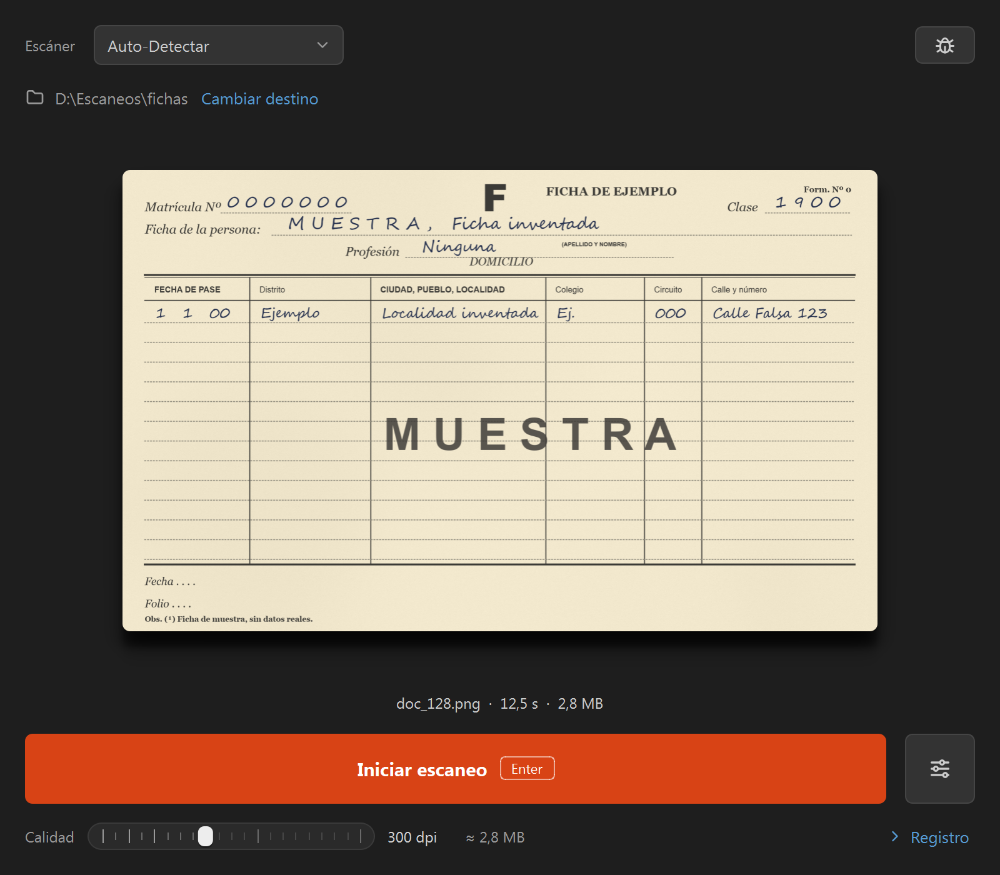

# La bestia

[](https://github.com/germankatz/scanner_driver/actions/workflows/build-windows.yml)

Aplicación de escritorio para digitalizar documentos en lote con un escáner de
cama plana en Windows. Escanea a la resolución elegida (300 dpi por defecto),
detecta el documento sobre la cama, lo endereza y lo guarda recortado y sin
pérdida, numerando los archivos solo.

Pensada para tandas largas: se escanea con Enter y no hay que tocar el diálogo
del escáner en ningún momento.



La ficha de la captura es inventada.

## Descarga

El ejecutable no necesita Python ni instalación:

**[Descargar la última versión](https://github.com/germankatz/scanner_driver/releases/latest)**

Requiere Windows y un escáner con driver WIA (los de Windows desde XP en
adelante lo son; TWAIN no está soportado). Funciona muy bien con la Lexmark
X646.

Hasta la versión 1.1.1 el programa se llamaba Antigravity Scanner y el
ejecutable `AntigravityScanner.exe`. Es el mismo programa: al actualizar
conserva la carpeta de destino, el prefijo y la calidad que ya estaban
configurados.

## Instalación y actualizaciones

El ejecutable suelto funciona desde cualquier carpeta. Para que además pueda
**actualizarse solo** tiene que estar donde los usuarios puedan escribir, y en
el Escritorio público no pueden. Por eso, en una PC que usan varias personas:

1. Copiá `LaBestia.exe` e `instalar.cmd` (los dos vienen en el release) a una
   misma carpeta. La de actualizaciones sirve.
2. En cada PC, desde una cuenta que pueda escribir en el Escritorio público,
   ejecutá `instalar.cmd`. Deja el programa en `C:\LaBestia`, crea el acceso
   directo **La bestia** en el escritorio de todos los usuarios y borra el
   `LaBestia.exe` o `AntigravityScanner.exe` suelto que hubiera ahí.

Se hace una sola vez por PC. Si hay que usar «Ejecutar como administrador»,
copiá antes los dos archivos a una carpeta de la PC: con permisos elevados
Windows no ve las unidades de red.

### Actualizar

Una versión nueva se publica copiando el `LaBestia.exe` del release a la
carpeta de actualizaciones, `H:\see\imagenes_fallecidos\LaBestia`, pisando el
anterior. Las PCs no necesitan internet: alcanza con que lleguen a esa
carpeta. La versión se lee del propio `.exe` (la que muestra Windows en
Propiedades > Detalles), así que no hay que renombrarlo ni copiar nada más.

Al abrir, el programa mira esa carpeta. Si hay una versión más nueva aparece
arriba el botón **Actualizar a x.y.z**, y con **Actualizar ahora** el programa
se cierra, se reemplaza y vuelve a abrir solo, para todos los usuarios de esa
PC. El botón de información, arriba a la derecha, muestra la versión instalada
y tiene **Buscar actualizaciones** para no esperar al próximo arranque.

Cualquier usuario de la PC puede modificar `C:\LaBestia`: es lo que permite
actualizar sin una cuenta con permisos. En la carpeta de actualizaciones, en
cambio, conviene que solo pueda escribir quien publica las versiones.

## Uso

1. Elegí el escáner en el desplegable de arriba, o dejá **Auto-Detectar**.
2. La carpeta de destino está a la vista arriba. Para cambiarla, o cambiar el
   prefijo, hacé clic en la carpeta o en **Cambiar destino**.
3. Poné el documento en la cama y presioná **Enter** (o el botón de escaneo).

Los archivos se numeran solos como `prefijo1.png`, `prefijo2.png`, etc. Si
borrás uno del medio, el siguiente escaneo rellena ese hueco.

Se guardan en **PNG**, que no tiene pérdida: para documentos con texto chico o
huellas dactilares, JPEG introduce artefactos justo en los bordes de alto
contraste, que es donde está la información.

Debajo de la imagen queda el nombre del archivo, cuánto tardó el escaneo y
cuánto pesa.

### Calidad

La barra de abajo a la izquierda elige la resolución del escaneo: 100, 150,
200, 300, 400 o 600 dpi. Al lado muestra cuánto va a pesar cada archivo,
estimado a partir del último escaneo. Más resolución da más detalle, pero el
archivo pesa más (el doble de dpi son cuatro veces más píxeles) y el escáner
tarda más en recorrer la cama. Se recuerda entre reinicios.

Si el driver del escáner no acepta la resolución elegida, el registro lo avisa
y la captura cae al diálogo nativo de Windows.

### Modo manual

El botón de modo manual abre el diálogo nativo de Windows y te deja controlarlo
a mano. Sirve cuando necesitás una configuración puntual que la app no expone
—escanear desde el alimentador, cambiar el modo de color— sin perder el recorte
automático posterior.

## Configuración

Se guarda en `%APPDATA%\LaBestia\config.json` y se recuerda entre reinicios.
Si ese archivo todavía no existe, se lee el del nombre anterior
(`%APPDATA%\AntigravityScanner\config.json`):

```json
{
  "output_dir": "H:\\ruta\\a\\la\\carpeta",
  "file_prefix": "doc_",
  "scan_dpi": 300
}
```

Si al arrancar el destino no está disponible —una unidad de red caída, por
ejemplo— la app avisa y guarda en una carpeta local temporal, **sin pisar la
configuración**. Cuando la unidad vuelve, sigue escribiendo donde corresponde.

Si en alguna PC la carpeta de actualizaciones está en otra ruta, se indica en
ese mismo archivo con `"update_dir"`. No se ofrece en la ventana.

## Qué dice el log

El registro reporta cada paso y arranca escondido; **Registro** (abajo a la
derecha) lo despliega. Con el registro cerrado, lo de rutina no se muestra:
solo cuando hay un aviso o un error aparece al pie, en pocas palabras (por
ejemplo, "El documento toca el borde"), y el detalle queda en el registro. Vale
la pena abrirlo en la primera corrida de cada jornada:

| Mensaje | Significa |
|---|---|
| `Captura directa WIA a 300 dpi: 2550x3500 px.` | Todo bien. La resolución se fijó y el driver la aceptó. |
| `Crudo recibido: 2550x3500 px.` | Tamaño de lo que entregó el escáner, antes de procesar. |
| `Documento detectado (otsu), enderezado y guardado...` | Se encontró el documento y se recortó. Entre paréntesis, la estrategia que funcionó. |
| `AVISO: el crudo salió 1200x1500 px (~150 dpi estimados)...` | La resolución quedó por debajo de lo pedido. El escaneo sirve pero tiene menos detalle del esperado. |
| `Captura directa no disponible (...). Cayendo al diálogo nativo.` | El driver rechazó el control directo. Funciona igual, por el camino viejo. |
| `AVISO: no se detectó el documento con ninguna estrategia...` | Se guardó la cama completa. El documento queda más chico dentro del archivo. |
| `AVISO: el documento toca el borde derecho de la cama...` | El documento llega al límite de lo que ve el escáner. Si ese borde salió cortado, correlo unos milímetros hacia adentro y volvé a escanear. |
| `Hay una versión nueva del programa: 1.3.1 (esta es la 1.3.0).` | Hay una actualización publicada. Arriba aparece el botón para instalarla. |
| `Todavía no se pudo borrar doc_12_raw.bmp (Acceso denegado)...` | El escaneo salió bien. Windows no dejó borrar el crudo porque otro programa lo tenía tomado; se borra solo al empezar el escaneo siguiente o al cerrar. |
| `AVISO: no se pudo borrar doc_12_raw.bmp (...). Hay que borrarlo a mano.` | Tampoco se pudo en el segundo intento. El escaneo está bien; sobra ese `_raw.bmp` en la carpeta. |

## Cuando algo sale mal

**Si la detección falla**, la app conserva el archivo `_raw.bmp` de ese escaneo
en vez de borrarlo. Ese crudo es lo que hace falta para averiguar por qué falló:
no lo borres.

Para analizarlo sin tener que reproducir el error: activá el modo debug (el
botón del bicho, arriba a la derecha). Al lado aparece **Procesar archivo**,
que solo se muestra en ese modo: abrí con él ese `_raw.bmp`. Hace el mismo
recorte que un escaneo pero sobre un archivo que ya está en disco, lo guarda
como un archivo nuevo y escribe un `debug_mask_*.jpg` por
cada estrategia que se intentó, así se ve en cuál se rompió la detección, y un
`debug_4_contour.jpg` con el contorno aproximado en rojo y el recorte final en
verde. El log agrega cuántos de los cuatro lados se pudieron medir sobre el
crudo.

**Si la resolución baja**, mirá si aparece el aviso en el log. Suele indicar que
el driver no aceptó los 300 dpi y hubo que caer al diálogo nativo.

**Si el escáner no aparece** en el desplegable, revisá que Windows lo reconozca
en *Dispositivos e impresoras*. La app solo lista dispositivos WIA de tipo
escáner.

## Cómo funciona por dentro

**Captura.** Se conecta por WIA y fija `XRES`/`YRES` a la resolución elegida por propiedades,
releyéndolas después para confirmar que el driver las aceptó de verdad. El área
de escaneo se recalcula desde el tamaño físico de la cama, porque cambiar la
resolución no siempre reescala el extent y quedarse con el viejo significa
escanear solo un pedazo.

**Marco.** El crudo trae en los bordes el labio del marco del escáner, una
franja clara de punta a punta. Se mide en cada escaneo y se recorta solo eso:
con el porcentaje fijo que se usaba antes, una ficha apoyada cerca del marco
perdía un borde.

**Detección.** Sobre una copia reducida a 800 px de alto (por velocidad) se
prueban cuatro estrategias en cascada, y se usa la primera que da un resultado
plausible:

1. Umbralización de Otsu
2. Otsu invertido, por si el papel cayó en la otra clase
3. Bordes de Canny, que encuentran el canto del papel aunque el contraste de
   brillo contra la tapa sea casi nulo
4. Desvío respecto del fondo de la cama, estimado con la mediana del marco

**Recorte.** El contorno de la copia reducida solo da un rectángulo aproximado:
cada píxel de ahí son unos 5 del crudo, y usarlo directo se comía varios
píxeles de papel o dejaba una cuña de cama. Los cuatro lados se vuelven a medir
sobre el crudo a resolución completa, ajustando una recta al canto del papel en
cada uno. Con eso se endereza el documento y se recorta dejando 2 px de cama
alrededor. Una ficha cortada fuera de escuadra deja ver un poco de cama de un
lado en vez de salir deformada. Si un lado no se puede medir (documento contra
el marco, tapa del mismo tono que el papel) se usa el del contorno aproximado.

**Lectura y guardado.** Leer el crudo y escribir el PNG eran tres cuartos del
tiempo de procesamiento, así que `fast_io.py` los hace por su cuenta: lee el
BMP del escáner directo a memoria y comprime el PNG por bandas en paralelo. El
resultado es el mismo que con OpenCV (la misma imagen leída, un PNG que
decodifica a los mismos píxeles) y cualquier caso fuera de lo común se lo deja
a OpenCV. Con eso, y con no calcular lo que no se usa en los demás pasos, el
procesamiento de un escaneo de cama oficio a 300 dpi pasó de unos 290 ms a
unos 85 ms. `LaBestia.exe --selftest` verifica que `fast_io` dé lo
mismo que OpenCV dentro del ejecutable.

## Desarrollo

```bash
pip install -r requirements.txt
python scanner_app.py
```

Para empaquetar (solo en Windows: PyInstaller no cross-compila):

```bash
pip install pyinstaller
pyinstaller LaBestia.spec
```

Cada push a `main` dispara un build en CI que deja el `.exe` como artifact.
Además de compilar, CI ejecuta el binario: `--selftest`, y
`ci/probar_actualizacion.py`, que arma una instalación de prueba y verifica
que se reemplace por una versión más nueva y vuelva a abrir.

La versión del programa está en `actualizador.VERSION` y el build la graba en
el `.exe`. Para publicar una versión: subirla ahí, pushear, y pushear el tag
`v` + esa versión (CI rechaza un tag que no coincida), que publica el release:

```bash
git tag -a v1.3.1 -m "descripción del cambio" && git push origin v1.3.1
```

Por último, copiar el `LaBestia.exe` del release a la carpeta de
actualizaciones.

`LaBestia.exe --actualizar-desde <carpeta>` hace lo mismo que el botón
**Actualizar ahora** sin abrir la ventana. Lo usa la prueba de CI, y sirve para
actualizar una PC desde un script.

### Utilidades de diagnóstico

Scripts sueltos para inspeccionar el escáner, útiles cuando un driver se
comporta distinto a lo esperado:

- `dump_properties.py` — vuelca todas las propiedades WIA del dispositivo
- `wia_interceptor.py` — muestra resolución, origen y modo de color, con los
  valores que cada uno admite
- `spy_wia.py` — compara las propiedades antes y después de usar el diálogo
  nativo, para ver qué toca realmente

## Datos personales

Esta herramienta se usa con documentación que contiene datos personales. Los
escaneos, los crudos `_raw.bmp` y las imágenes de debug están excluidos por
`.gitignore` y no deben subirse al repositorio.
